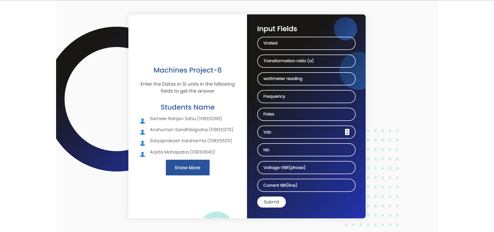

# 🎇Machines 2 Project
## About the Project
- A web-app that reads short circuit input data, and stator side ohmic resistance measurement data in the form of Vdc and Idc, and there after calculate the starting torque of the induction motor.
- It has 9 input fields taking inputs that takes the desired inputs and gives the pre required output. If there are certain discripencies in the data provided, it pops an error message.:)

## More Information
- For more Information one can refer to the presentation [here](https://www.canva.com/design/DAEauw-BMAo/PR5uAFZJ2gXvPpgd9oSqGg/view)

## Website Link
- [https://electrical-machines-project.netlify.app/](https://electrical-machines-project.netlify.app/)

## ⭐Technologies Used
    1. ReactJs

## Contributors ✨

Thanks goes to these wonderful people ([emoji key](https://allcontributors.org/docs/en/emoji-key)):

<!-- ALL-CONTRIBUTORS-LIST:START - Do not remove or modify this section -->
<!-- prettier-ignore-start -->
<!-- markdownlint-disable -->
<table>
  <tr>
    <td align="center"><a href="https://github.com/anshusandhi6"> <b>Anshuman Sandhibigraha</b></a> 💻</td>
    <td align="center"><a href="https://github.com/sameersahu473"> <b>Sameer Ranjan Sahu</b></a> 💻</td>
       <td align="center"><a href="https://github.com/Arpita-25"> <b>Arpita Mohapatra</b></a> 💻</td>
     <td align="center"><a href="https://github.com/satyaprakash-ops"> <b>Satyaprakash Karsharma</b></a> 💻</td>
   
  </tr>
</table>

<!-- markdownlint-enable -->
<!-- prettier-ignore-end -->
<!-- ALL-CONTRIBUTORS-LIST:END -->

This project follows the [all-contributors](https://github.com/all-contributors/all-contributors) specification. Contributions of any kind welcome!
